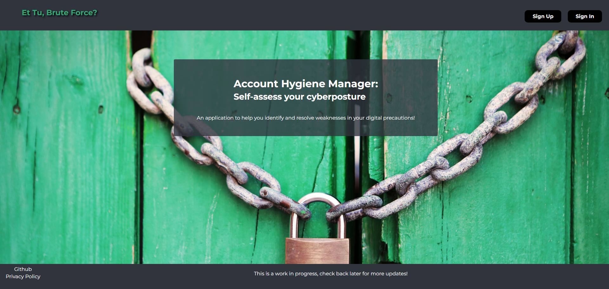

<h1>Et Tu, Brute Force?</h1>

<h1>Account Hygiene Manager: <small> Self-assess your cyberposture</small></h1>
    
An application to help you identify and resolve weaknesses in your digital precautions!

<h3>Test my app here:</h3>

<a href="#" target="_blank">#</a>

<h3>Assets used:</h3>
<ul>
<li>Photo by Life Of Pix from Pexels: https://www.pexels.com/photo/brass-colored-metal-padlock-with-chain-4291/</li>
</ul>

<h3>Technologies used:</h3> Javascript, HTML, CSS, EJS

<h3>Stretch goals:</h3>
<ul>
<li>Add passphrase hygiene</li>
<li>Add automated strength assessment of password based on checklist of pwd characteristics</li>
<li>Be able to mark certain items as frequently used (starring functionality)</li>
<li>Add functionality to change user account's username</li>
<li>Pwned_status - using API from Have i Been Pwned</li>
<li>Add functionality to change user account's password</li>
<li>Add functionality for expiry timer for user account's password</li>
<li>Add functionality for confirmation before deletion of an Identity</li>
<li>Add functionality to delete user account</li>
</ul>

<h3>Resources for further reading:</h3>